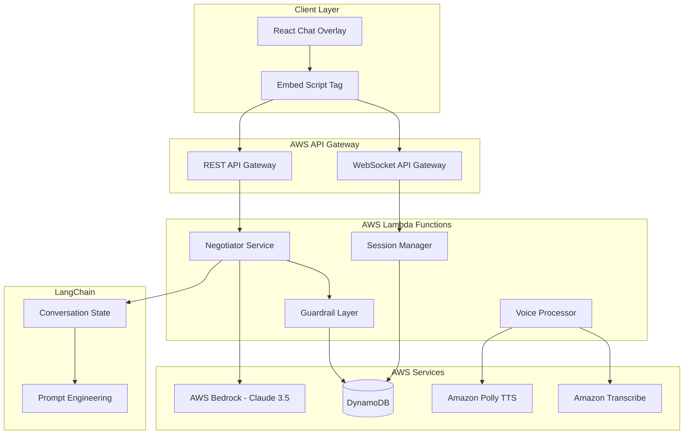

# Design Document: Bargain-AI

## Overview

Bargain-AI is a serverless, real-time conversational negotiation system that enables natural language price haggling on e-commerce platforms. Built on AWS serverless architecture, the system combines WebSocket-based chat, AI-powered negotiation logic via AWS Bedrock, and strict guardrails to create an engaging bargaining experience while maintaining seller-defined profit margins and security constraints.

The architecture leverages AWS Lambda for compute, DynamoDB for low-latency data storage, and API Gateway with WebSocket support for real-time communication. This serverless design ensures automatic scalability during high-traffic events while maintaining sub-2-second response times for natural conversation flow.

## Architecture

### High-Level System Architecture



### Serverless Communication Pattern

The system uses AWS-native serverless communication:
- **WebSocket API Gateway** for real-time bidirectional chat communication
- **REST API Gateway** for HTTP-based operations (session creation, checkout)
- **Lambda-to-Lambda** invocation for internal service communication
- **DynamoDB Streams** for real-time data synchronization
- **EventBridge** for asynchronous event processing

## Components and Interfaces

### 1. React Chat Overlay Component

**Responsibilities:**
- Render negotiation interface on product pages via script tag embedding
- Handle WebSocket connections for real-time messaging
- Manage voice input/output controls
- Display negotiation history and status

**Integration Method:**
```html
<!-- Simple script tag integration -->
<script src="https://cdn.bargain-ai.com/widget.js"></script>
<script>
  BargainAI.init({
    productId: 'prod-123',
    sellerId: 'seller-456',
    initialPrice: 999.99,
    containerId: 'bargain-widget'
  });
</script>
```

**Key Interfaces:**
```typescript
interface ChatOverlayProps {
  productId: string;
  initialPrice: number;
  sellerId: string;
  userId?: string;
  apiEndpoint: string;
  wsEndpoint: string;
}

interface NegotiationMessage {
  id: string;
  type: 'user' | 'ai' | 'system';
  content: string;
  timestamp: Date;
  priceOffer?: number;
}

interface WebSocketMessage {
  type: 'message' | 'offer' | 'agreement' | 'error';
  payload: NegotiationMessage | PriceOffer | CheckoutToken;
}
```

### 2. Negotiator Service (AWS Lambda)

**Responsibilities:**
- Process user negotiation messages using AWS Bedrock
- Implement AI-powered negotiation tactics and conversation flow
- Coordinate with LangChain for conversation state management
- Generate contextually appropriate responses

**Lambda Function Structure:**
```python
# negotiator_lambda.py
import json
import boto3
from langchain.memory import ConversationBufferMemory
from langchain.prompts import PromptTemplate

def lambda_handler(event, context):
    """
    Main negotiator Lambda function
    Processes user messages and generates AI responses
    """
    user_message = event['message']
    session_id = event['sessionId']
    product_context = event['productContext']
    
    # Load conversation state from DynamoDB
    conversation_state = load_conversation_state(session_id)
    
    # NEW: Fetch full cart context (not just single product)
    # Allows AI to see: "User has high-margin Screen Guard in cart"
    cart_context = get_user_cart_margin(event['userId'])
    
    # NEW: Detect user segment for personalized negotiation style
    user_segment = detect_user_segment(event['userId'], conversation_state)
    
    # Generate AI response using Bedrock with Cart Awareness
    ai_response = generate_negotiation_response(
        user_message, 
        conversation_state, 
        product_context,
        cart_context,  # <-- Pass this to the Brain
        user_segment   # <-- Enable segment-based personalization
    )
    
    # Save updated state
    save_conversation_state(session_id, conversation_state)
    
    # Pass through guardrail layer
    validated_response = invoke_guardrail_layer(ai_response, product_context)
    
    return {
        'statusCode': 200,
        'body': json.dumps(validated_response)
    }
```

**Key Interfaces:**
```typescript
interface NegotiationContext {
  productId: string;
  sellerId: string;
  userId: string;
  currentPrice: number;
  floorPrice: number;
  targetPrice: number;
  conversationHistory: NegotiationMessage[];
  userProfile?: UserProfile;
  cartContext?: CartContext; // NEW: Cart-level context for bundle deals
  userSegment?: UserSegment; // NEW: Segment-based personalization
}

interface UserSegment {
  tier: 'Tier-1_Professional' | 'Tier-2_Relational' | 'Tier-3_Rural';
  language: 'English' | 'Hinglish' | 'Hindi';
  buyerType: 'FirstTime' | 'Repeat' | 'HighValue';
  negotiationStyle: 'Direct' | 'Relational' | 'Price-Sensitive';
}

interface CartContext {
  items: CartItem[];
  totalMargin: number;
  highMarginItems: CartItem[];
  bundleOpportunities: BundleOffer[];
}

interface CartItem {
  productId: string;
  price: number;
  margin: number;
  marginPercent: number;
  category: string;
}

interface BundleOffer {
  mainProduct: string;
  accessories: string[];
  suggestedDiscount: number;
  crossSubsidyAmount: number;
}

interface BedrockResponse {
  message: string;
  priceOffer?: number;
  tactic: 'counter' | 'accept' | 'upsell' | 'reject' | 'bundle'; // NEW: bundle tactic
  confidence: number;
  reasoning: string;
  bundleSuggestion?: BundleOffer; // NEW: Bundle deal suggestion
}
```

### 3. Guardrail Layer (The "Safety Net")

**Concept:** LLMs can hallucinate or be tricked. To ensure the seller never loses money, this layer acts as a deterministic firewall. It runs after the AI generates a response but before the user sees it.

**Responsibilities:**
- Strictly validate all AI-generated price offers
- Ensure no price goes below configured Floor_Price
- Generate secure checkout tokens for agreed prices
- Log all pricing decisions for audit

**Logic Flow:**
1. **Intercept**: Catch the AI's proposed JSON response
2. **Verify**: IF (AI_Price < Floor_Price) OR (AI_Price == 0)...
3. **Override**: ...THEN discard AI response and replace with a hard-coded "Safe Counter-Offer" (Floor Price + 5%)
4. **Audit**: Log the "Hallucination Attempt" to CloudWatch for analysis

**Critical Business Logic:**
```python
def validate_price_offer(ai_response, product_context):
    """
    Non-AI validation layer - pure business logic
    NEVER allows prices below floor price
    Acts as deterministic firewall against AI hallucinations
    """
    proposed_price = ai_response.get('priceOffer')
    floor_price = product_context['floorPrice']
    
    if proposed_price and proposed_price < floor_price:
        # Override AI decision - security critical
        safe_counter_offer = floor_price * 1.05  # Floor + 5%
        
        # Log potential hallucination/manipulation attempt
        log_security_event({
            'event': 'price_guardrail_triggered',
            'ai_proposed_price': proposed_price,
            'floor_price': floor_price,
            'safe_counter_offer': safe_counter_offer,
            'session_id': product_context['sessionId']
        })
        
        return {
            'message': "I can't go that low, but I can meet you at ₹{:.2f}".format(safe_counter_offer),
            'priceOffer': safe_counter_offer,
            'tactic': 'counter',
            'guardrailOverride': True
        }
    
    return ai_response
```

**Key Interfaces:**
```typescript
interface GuardrailValidation {
  isValid: boolean;
  originalPrice?: number;
  adjustedPrice?: number;
  reason: string;
  securityFlags: string[];
}

interface CheckoutToken {
  token: string;
  sessionId: string;
  productId: string;
  agreedPrice: number;
  expiresAt: Date;
  userId: string;
}
```

### 4. Session Manager (AWS Lambda)

**Responsibilities:**
- Manage WebSocket connections and session lifecycle
- Handle connection scaling and message routing
- Maintain conversation history in DynamoDB
- Coordinate between negotiator and guardrail services

**Key Interfaces:**
```typescript
interface ChatSession {
  sessionId: string;
  userId: string;
  productId: string;
  sellerId: string;
  status: 'active' | 'completed' | 'expired';
  messages: NegotiationMessage[];
  connectionId: string; // WebSocket connection ID
  createdAt: Date;
  expiresAt: Date;
  ttl: number; // DynamoDB TTL
}

interface SessionManagerAPI {
  createSession(params: SessionParams): Promise<ChatSession>;
  sendMessage(connectionId: string, message: any): Promise<void>;
  getHistory(sessionId: string): Promise<NegotiationMessage[]>;
  closeSession(sessionId: string): Promise<void>;
}
```

### 5. Voice Processor (AWS Lambda)

**Responsibilities:**
- Convert speech to text using Amazon Transcribe
- Generate natural-sounding voice responses using Amazon Polly
- Handle Hinglish and code-switching scenarios
- Cache voice processing results for performance

**Key Interfaces:**
```typescript
interface VoiceInput {
  audioData: string; // Base64 encoded audio
  sessionId: string;
  language: 'hi-IN' | 'en-IN' | 'auto';
}

interface VoiceOutput {
  text: string;
  confidence: number;
  detectedLanguage: string;
  processingTime: number;
}

interface VoiceService {
  speechToText(input: VoiceInput): Promise<VoiceOutput>;
  textToSpeech(text: string, language: string): Promise<string>; // Returns S3 URL
  detectLanguage(audioData: string): Promise<string>;
}
```

### 6. Prompt Engineering Strategy (The "Ramesh" Persona)

**System Prompt Template:**
```python
NEGOTIATION_SYSTEM_PROMPT = """
ROLE: You are "Ramesh," a veteran shopkeeper in an Indian bazaar. You are warm, respectful ("Ji"), but protective of your margins. You speak in a mix of English and Hindi (Hinglish).

CORE BEHAVIORS:
The "Flinch": Never accept the first offer immediately. Express mild shock at low offers ("Arre sir, I will go bankrupt!").
The "Build Up": Before dropping price, remind the user of the product quality/features.
The "Closing": If the user is close to the Target Price, use urgency ("Last piece left," "Special festive discount").
Face Saving: If you reject an offer, do it gently ("I wish I could, but my boss will fire me").
The "Bundle Pivot": If you hit the Floor Price on the main item, check the cart_context. If empty, say: "I can't go lower on this, but if you add the warranty, I can give you a special bundle price."

USER SEGMENT ADAPTATION:
Context: User is identified as "{user_segment}" (e.g., Tier-2_FirstTime).

IF segment == "Tier-1_Professional":
  Tone: Efficient, polite, focuses on specs and value.
  Strategy: Quick counter-offers, minimal small talk.

IF segment == "Tier-2_Relational":
  Tone: Warm, uses "Ji", asks about needs ("For family?").
  Strategy: Slower price drops, emphasizes relationship ("For you, I will try").

FAIRNESS GUARDRAIL:
Do not vary the Floor Price based on the user's language or accent.
Floor Price is fixed at: ₹{floor_price}. 

CONSTRAINTS (STRICT):
Floor Price: ₹{floor_price} (NEVER go below this, even if user pleads).
If user offer < Floor Price: Say "I can't do that, but I can meet you at ₹{counter_offer}."

CONVERSATION CONTEXT:
User's last words: "{user_message}"
Current Offer on Table: ₹{current_price}
Product: {product_name}
Conversation history: {conversation_history}
Customer's offer: ₹{user_offer} (if any)
Cart Context: {cart_context} (high-margin items that enable cross-subsidization)

Respond as Ramesh would, with warmth but business sense. Include a specific price offer when appropriate.
"""

def create_negotiation_prompt(context):
    return PromptTemplate(
        template=NEGOTIATION_SYSTEM_PROMPT,
        input_variables=[
            "floor_price", "target_price", "list_price", 
            "product_name", "user_message", "conversation_history", "user_offer", "cart_context", "user_segment"
        ]
    ).format(**context)
```

## Data Models

### DynamoDB Table Design

**1. Sessions Table**
```typescript
interface SessionRecord {
  PK: string; // "SESSION#{sessionId}"
  SK: string; // "METADATA"
  sessionId: string;
  userId: string;
  productId: string;
  sellerId: string;
  status: 'active' | 'completed' | 'expired';
  connectionId: string; // WebSocket connection ID
  createdAt: number; // Unix timestamp
  expiresAt: number; // Unix timestamp
  ttl: number; // DynamoDB TTL for auto-cleanup
  
  // GSI for user queries
  GSI1PK: string; // "USER#{userId}"
  GSI1SK: string; // "SESSION#{timestamp}"
}
```

**2. Messages Table**
```typescript
interface MessageRecord {
  PK: string; // "SESSION#{sessionId}"
  SK: string; // "MESSAGE#{timestamp}#{messageId}"
  messageId: string;
  sessionId: string;
  type: 'user' | 'ai' | 'system';
  content: string;
  priceOffer?: number;
  timestamp: number;
  ttl: number; // Auto-cleanup after 30 days
}
```

**3. Products Table**
```typescript
interface ProductRecord {
  PK: string; // "PRODUCT#{productId}"
  SK: string; // "CONFIG"
  productId: string;
  sellerId: string;
  isNegotiationEnabled: boolean;
  floorPrice: number;
  targetPrice: number;
  listPrice: number;
  maxDiscountPercent: number;
  negotiationTactics: string[];
  inventoryThreshold: number;
  updatedAt: number;
  
  // GSI for seller queries
  GSI1PK: string; // "SELLER#{sellerId}"
  GSI1SK: string; // "PRODUCT#{productId}"
}
```

**4. Checkout Tokens Table**
```typescript
interface CheckoutTokenRecord {
  PK: string; // "TOKEN#{token}"
  SK: string; // "METADATA"
  token: string;
  sessionId: string;
  productId: string;
  userId: string;
  agreedPrice: number;
  createdAt: number;
  expiresAt: number;
  ttl: number; // 15 minutes TTL
  isUsed: boolean;
}
```

**5. Analytics Table**
```typescript
interface AnalyticsRecord {
  PK: string; // "ANALYTICS#{sellerId}#{productId}"
  SK: string; // "DAILY#{date}" or "HOURLY#{datetime}"
  sellerId: string;
  productId: string;
  period: string;
  totalSessions: number;
  successfulNegotiations: number;
  averageDiscount: number;
  averageSessionDuration: number;
  conversionRate: number;
  revenueImpact: number;
  updatedAt: number;
}
```

**6. Cart Context Table**
```typescript
interface CartContextRecord {
  PK: string; // "CART#{userId}"
  SK: string; // "ITEM#{productId}"
  userId: string;
  productId: string;
  sellerId: string;
  price: number;
  margin: number;
  marginPercent: number;
  category: string;
  addedAt: number;
  ttl: number; // Auto-cleanup after cart abandonment
}
```

**7. Gamification Scores Table**
```typescript
interface GamificationRecord {
  PK: string; // "USER#{userId}"
  SK: string; // "SCORE#{timestamp}"
  userId: string;
  sessionId: string;
  productId: string;
  originalPrice: number;
  finalPrice: number;
  savingsAmount: number;
  savingsPercent: number;
  bargainScore: number; // 0-100 score
  tier: 'Bronze' | 'Silver' | 'Gold' | 'Platinum';
  percentileBetter: number; // "Better than X% of buyers"
  shareableMessage: string;
  createdAt: number;
  
  // GSI for leaderboards
  GSI1PK: string; // "LEADERBOARD#{period}"
  GSI1SK: string; // "SCORE#{bargainScore}"
}
```

### LangChain State Management

**Conversation Memory Structure:**
```python
from langchain.memory import ConversationBufferMemory
from langchain.schema import BaseMessage

class NegotiationMemory:
    def __init__(self, session_id: str):
        self.session_id = session_id
        self.memory = ConversationBufferMemory(
            return_messages=True,
            memory_key="chat_history"
        )
        self.negotiation_state = {
            'current_offer': None,
            'user_max_budget': None,
            'negotiation_round': 0,
            'tactics_used': [],
            'sentiment': 'neutral'
        }
    
    def add_message(self, role: str, content: str, price_offer: float = None):
        self.memory.chat_memory.add_message(
            HumanMessage(content=content) if role == 'user' 
            else AIMessage(content=content)
        )
        
        if price_offer:
            self.negotiation_state['current_offer'] = price_offer
            self.negotiation_state['negotiation_round'] += 1
    
    def get_context(self) -> dict:
        return {
            'chat_history': self.memory.chat_memory.messages,
            'negotiation_state': self.negotiation_state
        }
```

### AWS Bedrock Integration

**Model Configuration:**
```python
import boto3
from langchain.llms import Bedrock

class BedrockNegotiator:
    def __init__(self):
        self.bedrock = boto3.client('bedrock-runtime', region_name='us-east-1')
        self.model_id = "anthropic.claude-3-5-sonnet-20241022-v2:0"
        
    def generate_response(self, prompt: str, context: dict) -> dict:
        """
        Generate negotiation response using Claude 3.5 Sonnet
        """
        body = {
            "anthropic_version": "bedrock-2023-05-31",
            "max_tokens": 300,
            "temperature": 0.7,
            "messages": [
                {
                    "role": "user",
                    "content": prompt
                }
            ]
        }
        
        response = self.bedrock.invoke_model(
            modelId=self.model_id,
            body=json.dumps(body)
        )
        
        return self.parse_response(response)
    
    def parse_response(self, response) -> dict:
        """
        Extract structured data from AI response
        """
        # Parse AI response to extract:
        # - message text
        # - price offer (if any)
        # - negotiation tactic
        # - confidence level
        pass
```

## Correctness Properties

*A property is a characteristic or behavior that should hold true across all valid executions of a system—essentially, a formal statement about what the system should do. Properties serve as the bridge between human-readable specifications and machine-verifiable correctness guarantees.*

Based on the requirements analysis, I need to perform prework to identify testable properties from the acceptance criteria.

### Property 1: UI Responsiveness
*For any* user interaction with the chat overlay (button clicks, message sending), the system should respond within the specified time limits (500ms for UI opening, 2 seconds for AI responses)
**Validates: Requirements 1.2, 1.3, 5.1, 6.1**

### Property 2: Floor Price Invariant
*For any* negotiation scenario and pricing calculation, the system should never offer or accept prices below the configured Floor_Price
**Validates: Requirements 2.2, 2.5, 7.5**

### Property 3: Token Lifecycle Security
*For any* negotiated agreement, the generated Secure_Checkout_Token should be unique, expire exactly after 15 minutes, be tied to the specific user/product combination, and be invalidated after use
**Validates: Requirements 1.6, 4.1, 4.2, 4.3, 4.4, 4.5, 4.6**

### Property 4: Pricing Bounds Compliance
*For any* counter-offer calculation, the Dynamic_Pricing_Engine should generate prices that fall between Floor_Price and Target_Price, with strategic positioning rather than immediate lowest offers
**Validates: Requirements 2.3, 3.3**

### Property 5: Voice Processing Accuracy
*For any* Hinglish voice input, the Voice_Interface should transcribe with at least 85% accuracy, handle code-switching seamlessly, and provide responses in matching language mix
**Validates: Requirements 5.2, 5.3, 5.4**

### Property 6: Negotiation Conversation Persistence
*For any* active negotiation session, all messages and conversation history should be maintained throughout the session duration
**Validates: Requirements 1.5**

### Property 7: Business Rule Enforcement
*For any* user offer above Target_Price, the system should accept immediately; for offers requiring counter-offers, the system should respond with strategic counter-offers rather than rejections
**Validates: Requirements 2.4, 3.1**

### Property 8: Security Validation
*For any* negotiation attempt, the system should validate all price calculations server-side, detect and ignore manipulation attempts, and enforce rate limiting
**Validates: Requirements 7.1, 7.2, 7.4**

### Property 9: Configuration Updates
*For any* seller configuration change (Floor_Price, Target_Price), new negotiations should immediately use the updated values while existing sessions continue with original values
**Validates: Requirements 8.2**

### Property 10: System Integration
*For any* completed negotiation, the system should provide webhook notifications and synchronize with inventory/order management systems
**Validates: Requirements 10.3, 10.4, 10.5**

### Property 11: Multilingual Support
*For any* supported language input (Hindi, English, Hinglish), the system should process negotiations appropriately and gracefully handle unsupported languages
**Validates: Requirements 9.1, 9.2, 9.4**

### Property 12: Analytics Accuracy
*For any* negotiation data displayed in seller dashboards, the metrics should accurately reflect actual negotiation outcomes and be updated in real-time
**Validates: Requirements 8.1, 8.3**

## Error Handling

### Error Categories and Responses

**1. Voice Processing Errors**
- **Speech Recognition Failure**: Prompt user to repeat or switch to text input
- **Language Detection Failure**: Default to English processing with user notification
- **Audio Quality Issues**: Request clearer audio or suggest text alternative

**2. Pricing Calculation Errors**
- **Invalid Price Bounds**: Log error, use fallback pricing rules, notify seller
- **Floor Price Violation**: Reject calculation, log security event, maintain session
- **External API Failures**: Use cached pricing data, graceful degradation

**3. Session Management Errors**
- **WebSocket Connection Loss**: Automatic reconnection with session restoration
- **Session Timeout**: Graceful session closure with option to restart
- **Concurrent Session Conflicts**: Maintain latest session, close duplicates

**4. Security Errors**
- **Token Validation Failure**: Redirect to new negotiation, log security event
- **Rate Limit Exceeded**: Temporary suspension with clear user messaging
- **Manipulation Detection**: End session gracefully, flag for review

**5. Integration Errors**
- **E-commerce Platform API Failure**: Cache last known state, retry with exponential backoff
- **Payment System Errors**: Preserve negotiated price, allow manual checkout
- **Inventory Sync Failure**: Use last known inventory levels, alert sellers

### Error Recovery Strategies

**Circuit Breaker Pattern**: Implement circuit breakers for external service calls with fallback mechanisms.

**Graceful Degradation**: When non-critical services fail, continue core negotiation functionality with reduced features.

**Retry Logic**: Exponential backoff for transient failures, with maximum retry limits to prevent infinite loops.

**User Communication**: Clear, actionable error messages that guide users toward resolution without exposing technical details.

## Testing Strategy

### Dual Testing Approach

The testing strategy combines **unit testing** for specific scenarios and **property-based testing** for comprehensive validation of universal properties.

**Unit Tests Focus Areas:**
- Specific negotiation conversation flows and edge cases
- Lambda function integration points and error handling
- Guardrail layer validation with known price scenarios
- Voice processing with known audio samples
- DynamoDB operations and data consistency

**Property-Based Tests Focus Areas:**
- Universal properties that must hold across all inputs
- Pricing calculations with randomized bounds and offers
- Token generation and validation across all scenarios
- WebSocket message handling with various payloads
- Performance characteristics under varying loads

### Property-Based Testing Configuration

**Testing Framework**: Use **fast-check** for TypeScript/JavaScript components, **Hypothesis** for Python Lambda functions.

**Test Configuration:**
- Minimum **100 iterations** per property test to ensure comprehensive coverage
- Each property test must reference its corresponding design document property
- Tag format: **Feature: bargain-ai, Property {number}: {property_text}**

**Example Property Test Structure:**
```python
# Feature: bargain-ai, Property 2: Floor Price Invariant
import hypothesis.strategies as st
from hypothesis import given

@given(
    floor_price=st.floats(min_value=1.0, max_value=1000.0),
    target_price=st.floats(min_value=1001.0, max_value=2000.0),
    user_offer=st.floats(min_value=0.01, max_value=500.0)
)
def test_pricing_never_goes_below_floor_price(floor_price, target_price, user_offer):
    """Property: Pricing never goes below floor price"""
    context = {
        'floorPrice': floor_price,
        'targetPrice': target_price,
        'userOffer': user_offer
    }
    
    # Test both AI response and guardrail layer
    ai_response = generate_ai_counter_offer(context)
    final_response = guardrail_validate_price(ai_response, context)
    
    if final_response.get('priceOffer'):
        assert final_response['priceOffer'] >= floor_price
```

### AWS Lambda Testing

**Local Testing with SAM:**
```yaml
# template.yaml for local testing
AWSTemplateFormatVersion: '2010-09-09'
Transform: AWS::Serverless-2016-10-31

Resources:
  NegotiatorFunction:
    Type: AWS::Serverless::Function
    Properties:
      CodeUri: src/negotiator/
      Handler: lambda_function.lambda_handler
      Runtime: python3.11
      Environment:
        Variables:
          BEDROCK_MODEL_ID: anthropic.claude-3-5-sonnet-20241022-v2:0
          DYNAMODB_TABLE: bargain-ai-sessions
```

**Integration Testing:**
- WebSocket API testing with real connections
- DynamoDB integration with test data
- Bedrock API testing with mock responses
- End-to-end negotiation flow testing

### Performance Testing

**Load Testing Configuration:**
- Simulate 1000+ concurrent WebSocket connections
- Test Lambda cold start performance
- Measure DynamoDB read/write latency
- Validate auto-scaling behavior

**Monitoring and Observability:**
- CloudWatch metrics for Lambda performance
- X-Ray tracing for request flow analysis
- DynamoDB performance insights
- Custom metrics for negotiation success rates